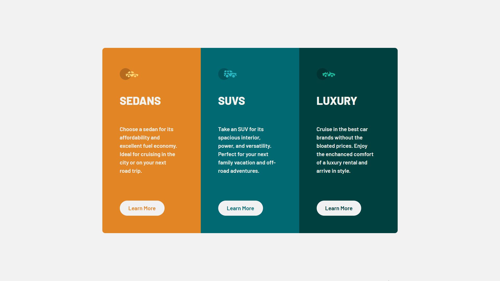

# CSS Challenge 1

We were assigned this task as we were learning more advanced CSS methods and functionality.
So for this particular assignment we were given a challenge from the Frontend Mentor website where we were tasked with recreating one of their projects. 

It was to test our at the time CSS skills as well as to challenge us to recreate a design from just an image alone. It was also to challenge us to use @media queries to adjust the site and make it suitable for phone users.

